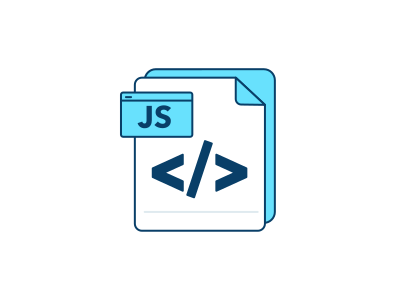

<a name="readme-top"></a>

<br />
<div align="center">
  <a href="https://github.com/topcowmoo/windy-e-commerce-site">
    
  </a>

<h3 align="center">Windy E-Commerce Site</h3>

  <p align="center">
   <!-- Developers frequently have to create interfaces that allow non-developers to easily view and interact with information stored in databases. These interfaces are called content management systems (CMS). Light Employee Manger is a command-line application that manages a company's employee database, using Node.js, Inquirer, and MySQL. -->

To see how it works please view my demo:

<!-- https://drive.google.com/file/d/1oSwtuzCqikUOLJWFxbwRfcQC4jHJNJuS/view?usp=sharing -->
  <br />
    <a href="https://github.com/topcowmoo/windy-e-commerce-site"><strong>Explore the docs »</strong></a>
    <br />
    <br />
    <!-- <a href="https://pacific-basin-11264-4d339f96ea1b.herokuapp.com/">Link to Deployed app on Heroku</a>
    · -->
    <a href="https://github.com/topcowmoo/windy-e-commerce-site/issues">Report Bug</a>
    ·
    <a href="https://github.com/topcowmoo/windy-e-commerce-site/issues">Request Feature</a>

  </p>
</div>

<!-- TABLE OF CONTENTS -->

<details>
  <summary>Table of Contents</summary>
  <ol>
    <li>
      <a href="#about-the-project">About The Project</a>
      <ul>
        <li><a href="#built-with">Built With</a></li>
      </ul>
    </li>
        <li><a href="#installation">Installation</a></li>
      </ul>
    </li>
    <li><a href="#contributing">Contributing</a></li>
    <li><a href="#contact">Contact</a></li>
    <li><a href="#acknowledgments">Acknowledgments</a></li>
  </ol>
</details>

<!-- ABOUT THE PROJECT -->

## About The Project

An E-Commerce site configured with a working Express.js API which uses Sequelize to interact with a MySQL database.

<!-- Landing page:


Retrieve saved notes:


Add a new note with Save and Clear Buttons present:


db.json file showing saved notes each with unique ID's:

 -->

<!-- BUILT WITH -->

## Built With

<a href="HTML-url">
  
  
  
  
</a>

<!-- INSTALLATION -->

### Installation

1. Clone the repo
   ```sh
   git clone https://github.com/topcowmoo/windy-e-commerce-site
   ```
2. Install NPM packages
   ````sh
   npm install   ```
   ````

<p align="right">(<a href="#readme-top">back to top</a>)</p>

<!-- CONTRIBUTING -->

## Contributing

Contributions are what make the open source community such an amazing place to learn, inspire, and create. Any contributions you make are **greatly appreciated**.

If you have a suggestion that would make this better, please fork the repo and create a pull request. You can also simply open an issue with the tag "enhancement".
Don't forget to give the project a star! Thanks again!

1. Fork the Project
2. Create your Feature Branch (`git checkout -b feature/AmazingFeature`)
3. Commit your Changes (`git commit -m 'Add some AmazingFeature'`)
4. Push to the Branch (`git push origin feature/AmazingFeature`)
5. Open a Pull Request

<p align="right">(<a href="#readme-top">back to top</a>)</p>

<!-- CONTACT -->

## Contact

Your Name - [@github_username](https://github.com/topcowmoo) - mammoliti.sam@gmail.com

Project Link: [https://github.com/topcowmoo/windy-e-commerce-site](https://github.com/topcowmoo/windy-e-commerce-site)

<p align="right">(<a href="#readme-top">back to top</a>)</p>

<!-- ACKNOWLEDGMENTS -->

## Acknowledgments

- [Sequelize](https://sequelize.org/)
- [MySQL](https://www.mysql.com/)
- [ChatGPT](https://chat.openai.com/)
- [Best README Template](https://github.com/othneildrew/Best-README-Template)
- [Iconduck](https://iconduck.com/)
- [Shields.io](https://shields.io/)

<p align="right">(<a href="#readme-top">back to top</a>)</p>

---


